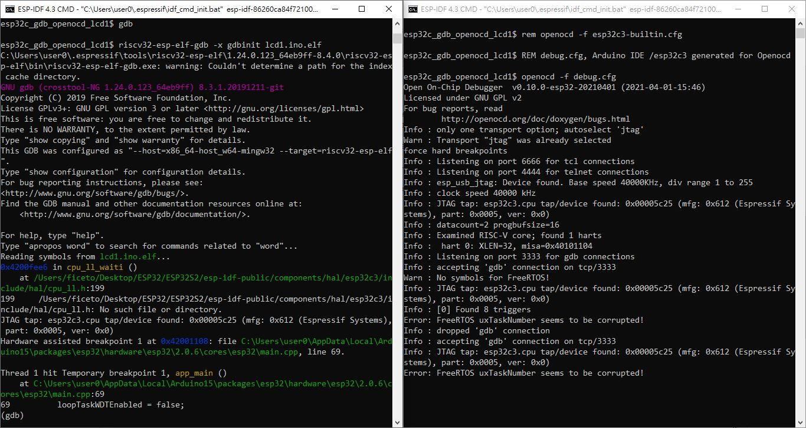

# ESP32-C3-USBJATAG_debug
setup and note

uninstall all libusb driver if used TinyISP for AVR or similar, the driver has conflict against espressif USB/JTAG dirver (same libusb named)

download https://dl.espressif.com/dl/idf-env/idf-env.exe

save to  
```
%userprofile%\Desktop\esp-idf-v4.3
```

open ESP-IDF command prompt, default open the folder mentioned above.  
install this esp usb driver, total 4 differents chips, USB/JTAG by esp / FT232 like / CP2102 like / CH343 like 
```
idf-env.exe driver install --espressif --ftdi --silabs --wch
```

output log like this,
```
C:\Users\user0\Desktop\esp-idf-v4.3>idf-env.exe driver install --espressif --ftdi --silabs --wch
Using cached directory: C:\Users\user0\.espressif/tools/idf-driver/silabs-2021-05-03
Ok
Using cached directory: C:\Users\user0\.espressif/tools/idf-driver/ftdi-2021-05-03
Ok
Using cached directory: C:\Users\user0\.espressif/tools/idf-driver/idf-driver-esp32-usb-jtag-2021-07-15
Ok
Using cached directory: C:\Users\user0\.espressif/tools/idf-driver/whc-ch343ser-2022-08-02
Ok
Ok
Requesting elevation of privileges for: C:\Users\user0\.espressif\idf-env.exe driver install --espressif --ftdi --silabs --wch --no-download
Exit code: 0x2a
Ok

C:\Users\user0\Desktop\esp-idf-v4.3>
```


open 2 target folder,   
copy howto_debug to the target folder  
ocd.bat, open openocd with configure file, ensure provide target .elf  
gdb.bat, invoke gnu-debugger  


  

